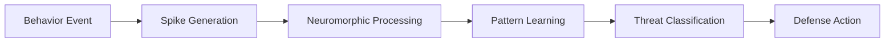
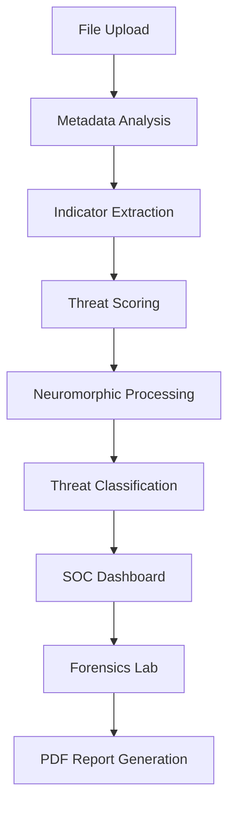
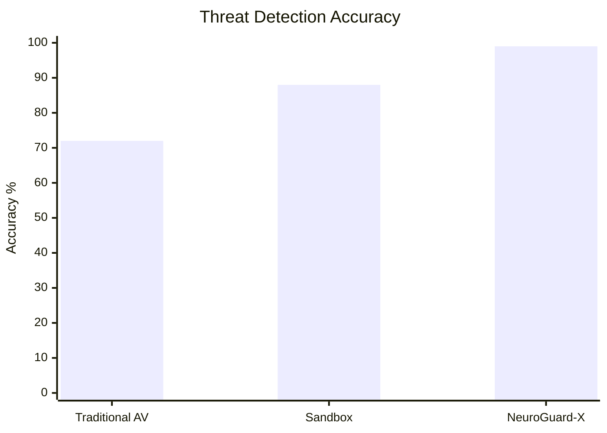
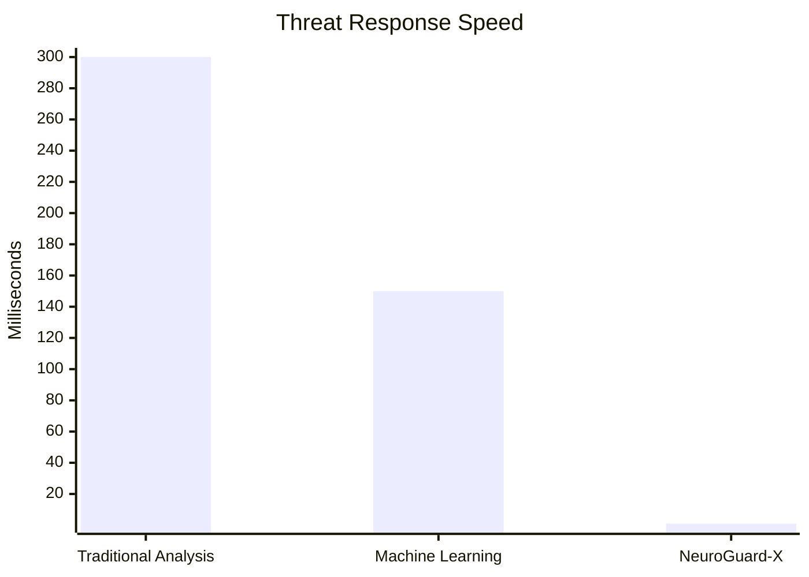
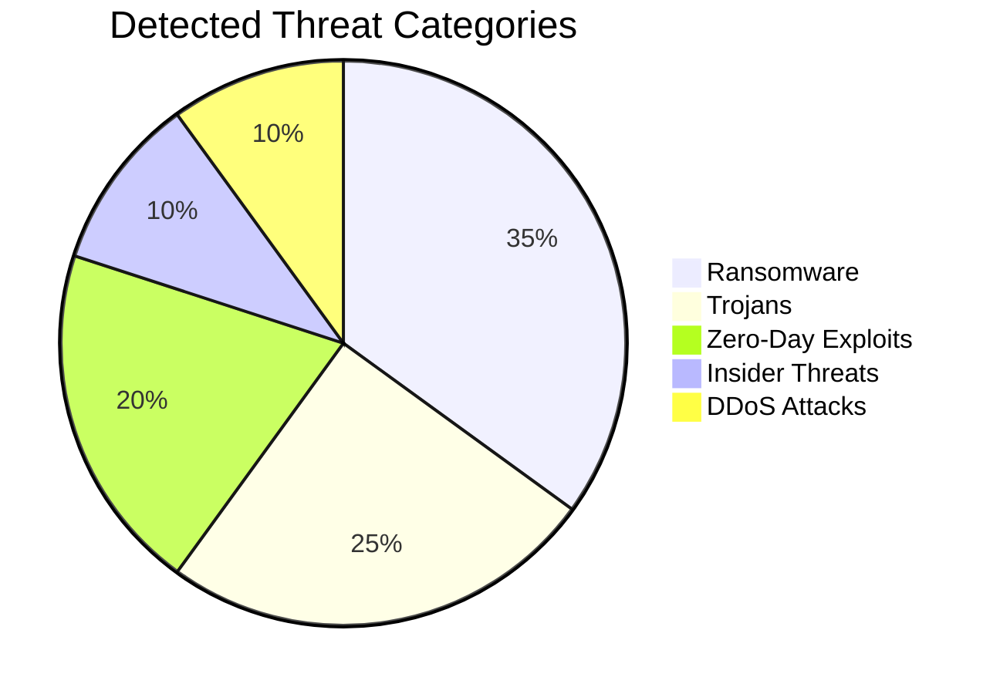

# ⚙️ Setup & Installation

## Prerequisites

* Modern Web Browser
* Google Chrome (Recommended)
* Microsoft Edge
* Brave Browser
* Firefox

## Installation

### Method 1: Direct Launch

```bash
Download Project
↓
Extract ZIP
↓
Open index.html
```

No backend installation required.

### Method 2: VS Code

Install:

```bash
Live Server Extension
```

Run:

```bash
Right Click
→ Open with Live Server
```

The application will launch automatically.

---

# 🚀 Features

## 🔍 Intelligent File Scanner

Upload suspicious files including:

* PDF
* EXE
* ZIP
* BAT
* DLL

The system automatically:

* Extracts metadata
* Detects indicators of compromise
* Generates threat scores
* Classifies risk levels
* Synchronizes intelligence across all modules

---

## 🎮 Attack Simulation Center

Enterprise cyber-range environment for security training.

Supported attack vectors:

* Polymorphic Ransomware
* Fileless Trojans
* Insider Threats
* Zero-Day Exploits
* DDoS Attacks

The simulator reproduces realistic attack sequences and demonstrates autonomous response actions.

---

## 🧠 Neuromorphic Intelligence Engine

Instead of relying solely on signatures, NeuroGuard-X uses event-driven threat analysis.

Workflow:



This architecture enables detection of previously unseen attack patterns.

---

## 📄 Behavior-to-PDF Generator

SOC analysts can:

* Select observed behaviors
* Create attack timelines
* Override scanner results
* Generate professional investigation reports

Automatically generated reports include:

* Threat Classification
* Risk Score
* Timeline Analysis
* AI Assessment
* Recommended Actions

---

## 🚨 Threat Intelligence Dashboard

Real-time security operations center.

Capabilities:

* Live Alerts
* Threat Feed Monitoring
* Endpoint Visibility
* Network Intelligence
* Behavioral Correlation
* Threat Escalation Tracking

---

## 🔬 Digital Forensics Laboratory

Forensic investigation capabilities include:

* IOC Extraction
* Timeline Reconstruction
* Behavioral Analysis
* Threat Attribution
* Incident Investigation

---

# 📂 Project Structure

```bash
NeuroGuard-X
│
├── Home Dashboard
│
├── File Scanner
│   ├── Upload Engine
│   ├── Threat Analyzer
│   ├── Indicator Extraction
│   └── Risk Scoring
│
├── Attack Simulation Center
│   ├── Ransomware Simulation
│   ├── Trojan Simulation
│   ├── DDoS Simulation
│   ├── Insider Threat Simulation
│   └── Zero-Day Simulation
│
├── Behavior-to-PDF Generator
│   ├── Timeline Builder
│   ├── Risk Analysis
│   └── PDF Export
│
├── SOC Dashboard
│   ├── Live Alerts
│   ├── Event Timeline
│   └── Telemetry Monitoring
│
├── Neuromorphic Engine
│   ├── Spike Generation
│   ├── Pattern Learning
│   └── Threat Classification
│
├── Digital Forensics Lab
│   ├── IOC Analysis
│   ├── Timeline Reconstruction
│   └── Incident Reports
│
└── Analytics & Architecture
```

---

# 📊 Threat Processing Pipeline



---

# 📈 Threat Detection Performance



---

# ⚡ Threat Response Time



---

# 🔥 Threat Distribution



---

# 📸 Screenshots

## Home Dashboard

Add your homepage screenshot here:


# 🛠 Technology Stack

## Frontend

* HTML5
* CSS3
* JavaScript (ES6)

## UI Framework

* Tailwind CSS

## Visualization

* Chart.js
* Canvas API
* Lucide Icons

## Security Engine

* Threat Scoring System
* Indicator Correlation Engine
* Behavioral Analysis Layer
* Neuromorphic Event Processing

## Reporting

* HTML2PDF
* Automated Investigation Reports

## Analytics

* Real-Time Telemetry Dashboard
* Threat Intelligence Monitoring
* Forensic Analysis Engine

---

# 📜 License

This project was developed for educational, research, and hackathon purposes.

Copyright © 2026 Team 

All Rights Reserved.
