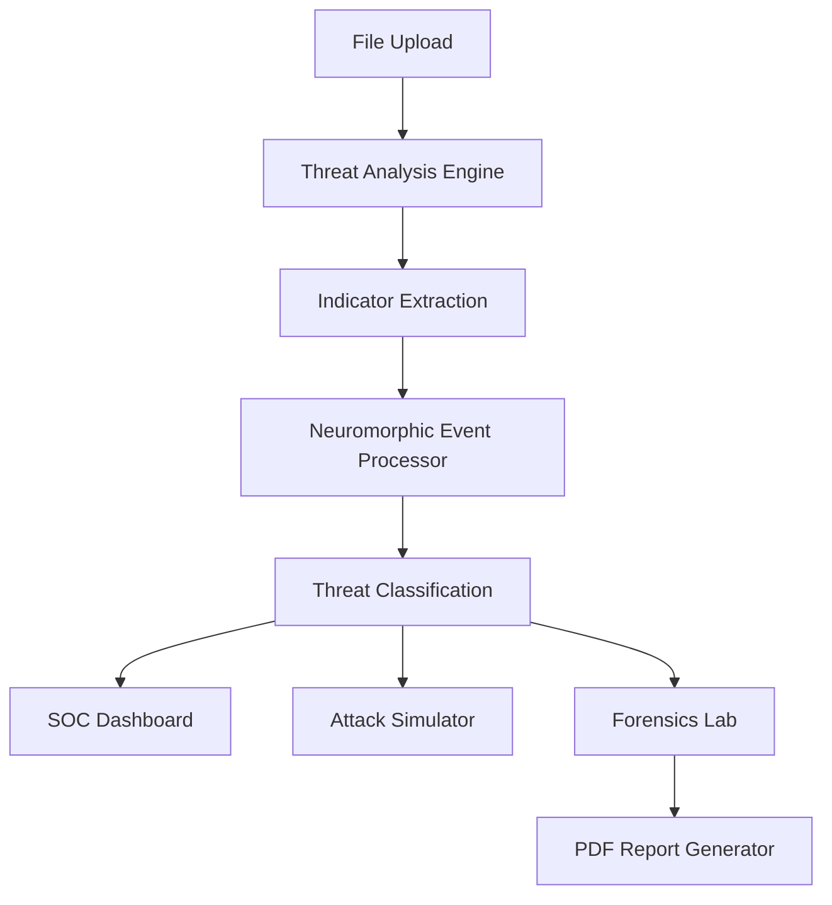
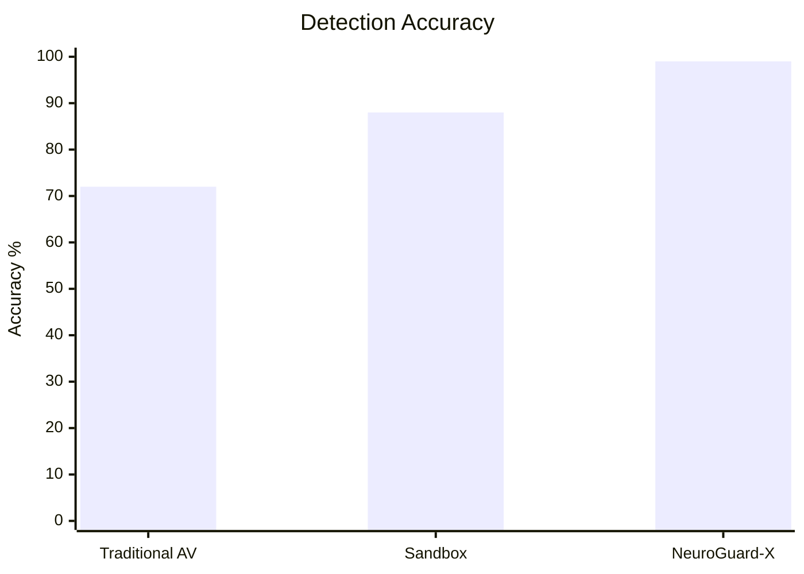
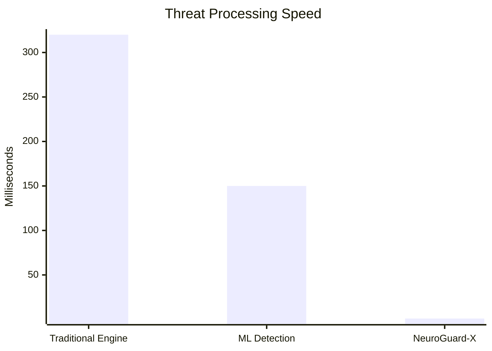
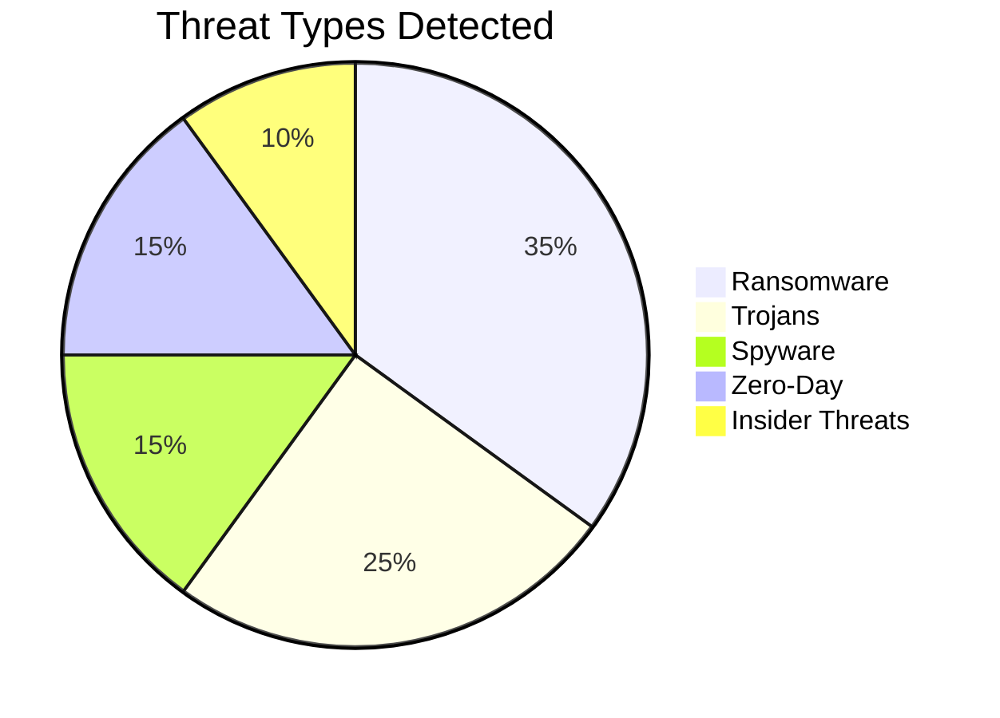
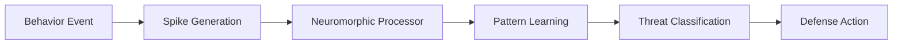
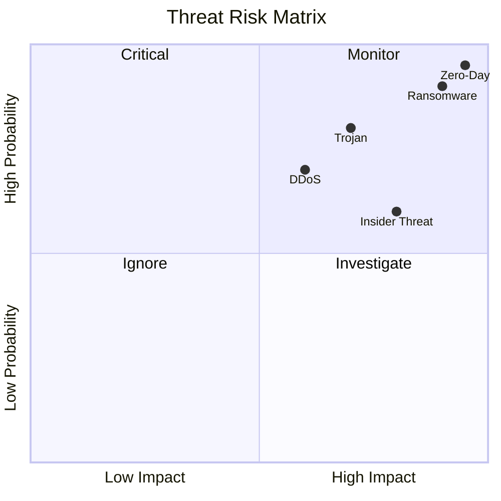
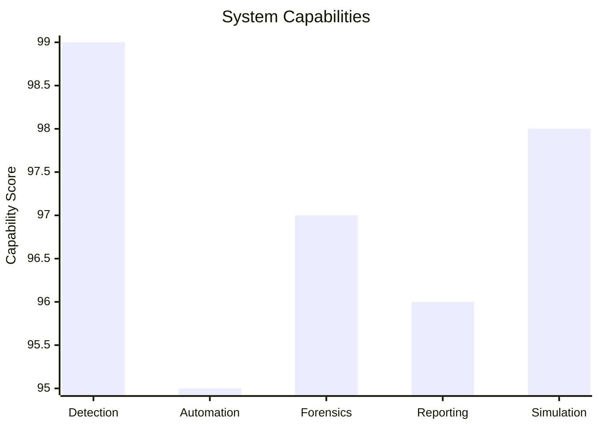

# 🛡️ NeuroGuard-X
### Enterprise Neuromorphic Cyber Defense Platform

> Detect. Analyze. Simulate. Defend.

NeuroGuard-X is a next-generation cyber defense platform that combines event-driven neuromorphic intelligence, threat simulation, behavioral analysis, forensic investigation, and automated SOC reporting into a unified security ecosystem.

Unlike traditional signature-based security tools, NeuroGuard-X focuses on behavioral events and threat patterns, enabling rapid identification of advanced malware, ransomware, trojans, insider threats, and zero-day attacks.

---

# 🎯 Project Overview

NeuroGuard-X provides:

- File Threat Analysis
- Attack Simulation Center
- Neuromorphic Threat Detection
- Security Operations Dashboard
- Digital Forensics Lab
- Automated Threat Reporting
- Behavioral Intelligence Engine

---

# 🏗 Platform Architecture



---

# ⚡ Threat Detection Workflow

```mermaid
sequenceDiagram

User->>NeuroGuard-X: Upload File
NeuroGuard-X->>Analysis Engine: Extract Metadata
Analysis Engine->>Threat Engine: Evaluate Indicators
Threat Engine->>Neuromorphic Core: Generate Events
Neuromorphic Core->>SOC Dashboard: Alert
SOC Dashboard->>Analyst: Threat Report
```

---

# 📊 Threat Detection Performance



---

# 📈 Threat Classification Efficiency



---

# 🔥 Threat Distribution



---

# 🧠 Neuromorphic Intelligence Pipeline



---

# 🚨 Security Operations Center

Features:

- Real-Time Alert Feed
- Threat Intelligence Dashboard
- Endpoint Monitoring
- Network Monitoring
- Event Correlation
- Live Threat Scoring
- Behavioral Analytics

---

# 🎮 Attack Simulation Center

Supported Attack Vectors:

### Ransomware

- File Encryption
- Lateral Movement
- Persistence Attempts

### Trojan

- Command & Control Communication
- Process Injection
- Credential Theft

### Insider Threat

- Data Exfiltration
- Privilege Abuse
- Unauthorized Access

### Zero-Day Exploit

- Memory Corruption
- Unknown Payload Execution
- Signature Evasion

### DDoS Attack

- Traffic Flooding
- Resource Exhaustion
- Service Disruption

---

# 🔬 Digital Forensics Lab

Capabilities:

- Timeline Reconstruction
- Behavioral Analysis
- IOC Extraction
- Threat Attribution
- Event Correlation
- Incident Investigation

---

# 📊 Risk Assessment Matrix



---

# 🛠 Technology Stack

## Frontend

- HTML5
- CSS3
- JavaScript
- Tailwind CSS

## Visualization

- Chart.js
- Canvas API
- Lucide Icons

## Security Components

- Threat Scoring Engine
- Behavioral Analysis Engine
- Neuromorphic Event Processor
- IOC Correlation System

## Reporting

- HTML2PDF
- Automated Investigation Reports
- SOC Intelligence Reports

---

# 📈 Platform Metrics



---

# 🎯 Key Features

✅ File Upload Scanner

✅ Threat Scoring Engine

✅ Neuromorphic Detection

✅ Attack Simulation Center

✅ SOC Dashboard

✅ Live Alert Feed

✅ Behavioral Intelligence

✅ Digital Forensics

✅ IOC Extraction

✅ Automated PDF Reports

---

# 🚀 Future Scope

- Intel Loihi Integration
- Neuromorphic Hardware Deployment
- Edge Security Appliances
- National Cyber Defense Grid
- Autonomous Threat Hunting
- AI-Powered Threat Prediction
- Global Threat Intelligence Sharing

---

# 🏆 Innovation Highlights

- Event-Driven Cyber Defense
- Neuromorphic Threat Detection
- Real-Time Threat Intelligence
- Autonomous Security Operations
- Behavioral Malware Analysis
- Zero-Day Threat Detection
- Automated Investigation Reports
- National-Scale Security Architecture

---

# 👨‍💻 Team Diamonds

### NeuroGuard-X

**Enterprise Neuromorphic Cyber Defense Platform**

*"Transforming cybersecurity from reactive defense to intelligent autonomous protection."*
